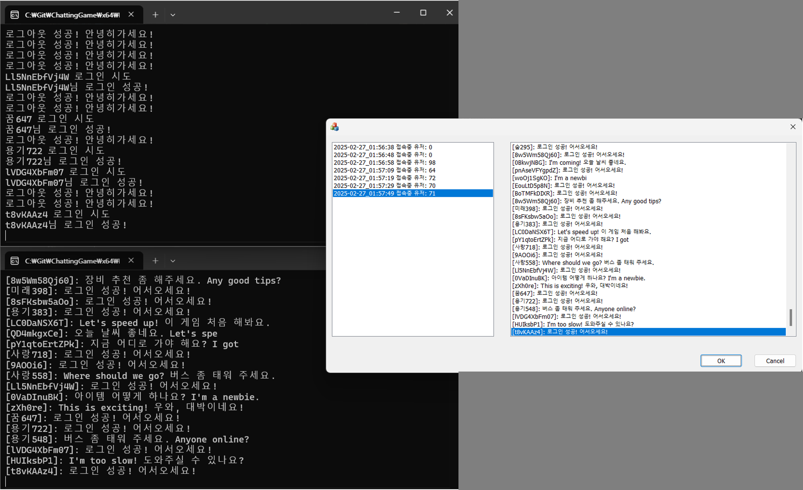

---
languages:
- C++
products:
- ISO C++20
- Windows SDK 10.0
page_type: 개인 프로젝트
name: "Chatting Program"
description: "많은 유저 접속을 위한 채팅 서버 제작"
---

# 멀티 유저 채팅 프로그램

이 저장소는 멀티 유저 채팅 프로그램을 저장하는 저장소입니다.
이 저장소는 여러 클라이언트가 서버에 연결되어 여러 요청이 있을 때 작업을 신속하게 처리하는 방법을 연습하기 위한 개인 작업물입니다.

 

## 프로젝트 구성

* [[Main] 여러 개의 IOCP를 사용한 서버](https://github.com/Mgcllee/ChattingGame/tree/master/multi_IOCP_server)  
* [[Sub] 1개의 IOCP를 사용한 서버](https://github.com/Mgcllee/ChattingGame/tree/master/one_IOCP_server)  

 

## 현재 프로젝트의 한계
1. 다양한 Windows API를 사용하세요. 따라서 운영 체제가 Windows일 때만 작동합니다.

 

## License
This repository is licensed with the **MIT license**.
