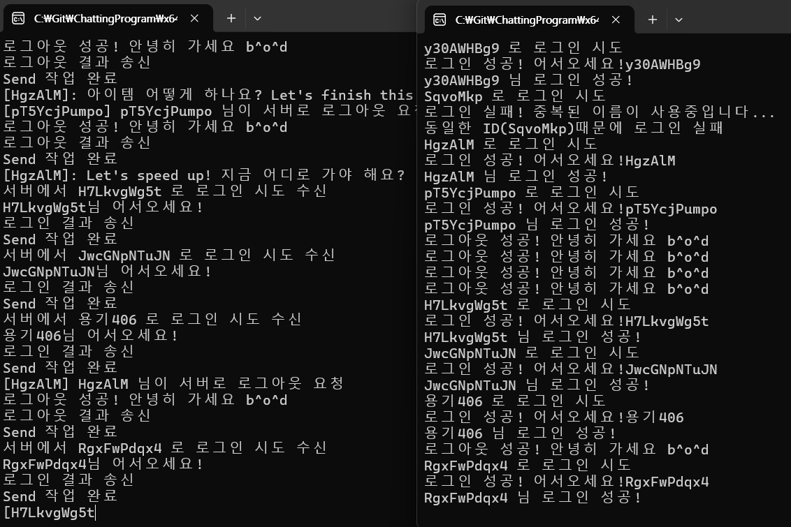

# Multi-User chatting program

This repository is Multi-User chatting game program.

This repository is a personal work piece to practice how multiple clients connect to the server and expedite tasks when multiple requests are made.  

 

## In this repository

* [Chatting Game Server Project readme file](https://github.com/Mgcllee/ChattingGame/blob/master/ChatServer/readme.md)  
* [Chatting Game Server Project code](https://github.com/Mgcllee/ChattingGame/blob/master/ChatServer)  
* [Chatting Game Client Project readme file](https://github.com/Mgcllee/ChattingGame/blob/master/ChatServer/readme.md)  
* [Chatting Game Client Project code](https://github.com/Mgcllee/ChattingGame/blob/master/ChatClient)  

 

## The limitations of the current project
1. Use a variety of Windows APIs. Therefore, it only works when the operating system is Windows.

 

## License

This repository is licensed with the MIT license.
